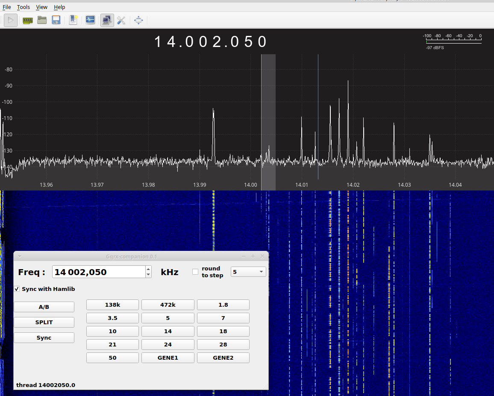

# GQRX-Companion

This software can synchronize a hardware transceiver with **GQRX** via **hamlib**.

Tested on *ubunutu 20.04*, analog rig TS590S, SDR : redpitaya or RSP1A.

Should work on most linux distros and with any rig supported by hamlib and any SDR supported by GQRX.

May be some adaptations are necessary. See *config.py*

### Usage :
  

 1. Fisrt launch **rigctld** with parameters corresponding to your rig and<u> make sure your analog rig can be driven</u> :

    Example for ts590 on default port 4532 using /dev/usb0 :  `rigctld -m 231 -r /dev/usb0`

 2. Launch GQRX to control your SDR and activate  **"Remote Control Via TCP"** 
 
 3. Then launch **grqrx-companion** by command line or via the desktop launcher (you will have to adapt it).
 
    -check "sync with hamlib" to link SDR and hardware transceiver.

    -tip : you can set gqrx-companion window in "stay on top" mode to easly access gqrx and companion at the same time..

### Configurations
   * TCP ports, band limits, ... are configurable in **config.py**
   
### Requirement 

   * python3

   * pyQt5

   * hamlib

   * GQRX

### Limitations / known bugs

   * round to step : to buggy. commented out in code.
   
   * band memories : not very usefull because non persistant yet.

   * VFO A/B : buggy not sync with band buttons

   * SPLIT : not implemeted yet

   * Direct frequency entry : not implemeted yet

